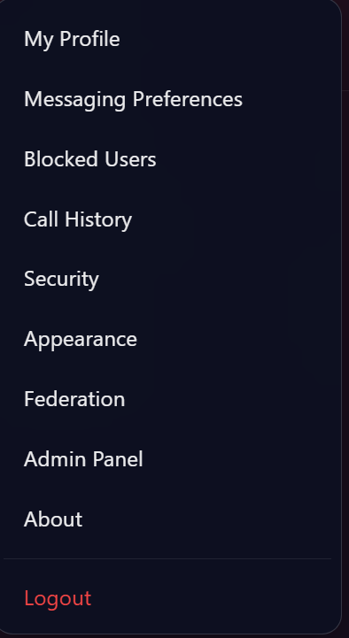
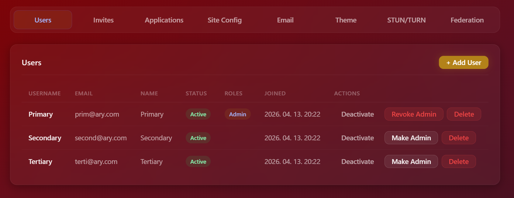
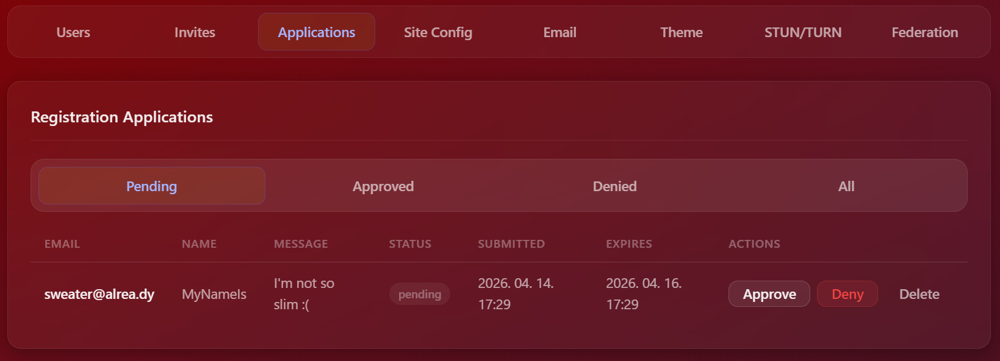
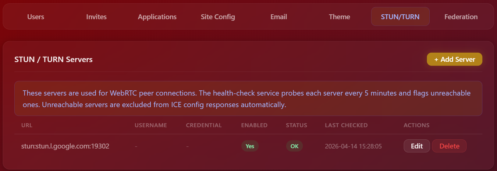
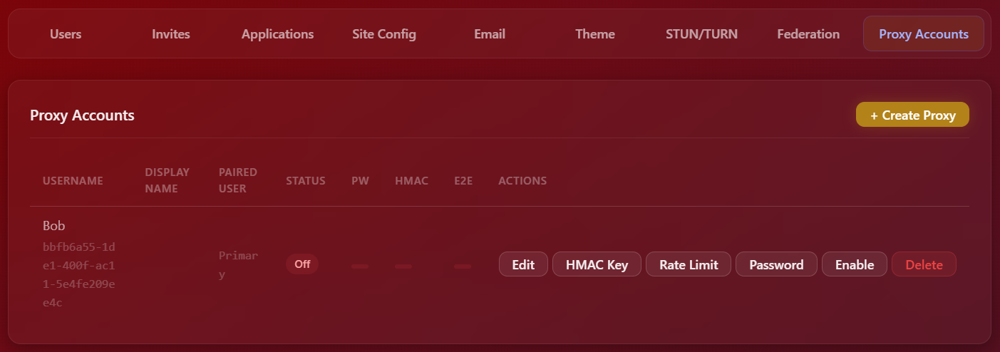

# Admin guide to browser interface

For admins only difference in the options is the "Admin Panel"

## User tab

## Registration applications

Registration Applications do not mean software applications, but one of the user registration modes, where instead of free registration, or invititation based registration, the user requests that they can register.

## Invitations

Invites can be done with either emails, or by the admin giving an invite link in another way to the user. Invites can be tied to email addresses, so they can only be used with that email address.

## Frontend theme

Server side color scheme settings. Some text configuration for a tiny bit more personalization.

## Site config (server options)

The most significant options are on this page. Registration mode, enabling other systems, media storage path.

## SMTP (emailing)

SMTP Email settings.

## STUN/TURN Addresses

External STUN/TURN server addresses, for webRTC (audio/video call).

## Server-to-Server Federation

Server-to-server communication. Enabling gives the option to start connections with other servers, allowing users of different servers to communicate.

## Proxy system

The proxy system is for automation (bots). There are proxies that are tied to users (one per user) and proxies that are managed by admins. Proxies are rate-limited, with there being a server side limit, and a per proxy limit, and out of the two the lower is the one applied to the proxy. Both limited in file upload size, and connection numbers, both per minute.

There are two authentication options.
- Session based (same as regular users) with the caveat that there are separate login and logout endpoints for proxies.
- HMAC signed one-shots. The functionalities one would usually expect to use, like creating a post, or sending a message; available without creating a session. A key is created while in session as a user or admin for the proxy, that key can be used to sign the message.
