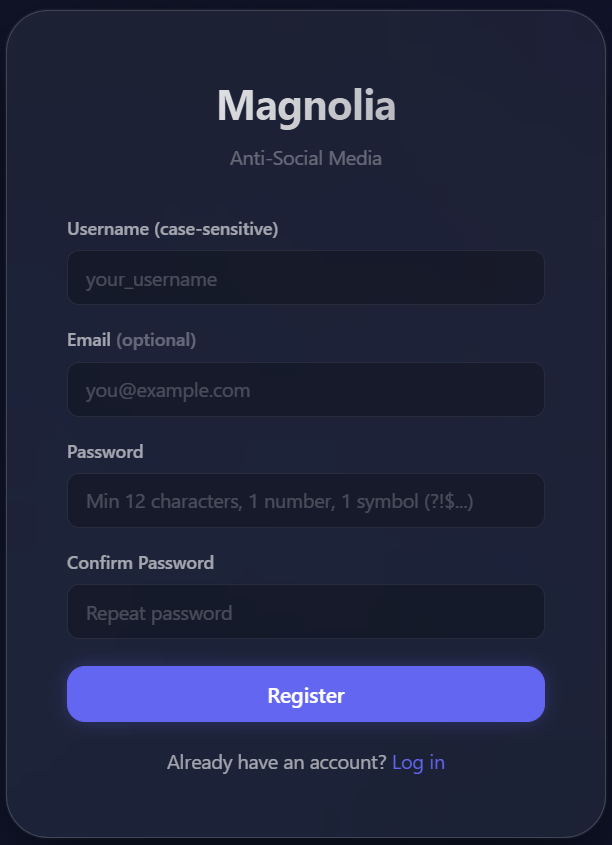
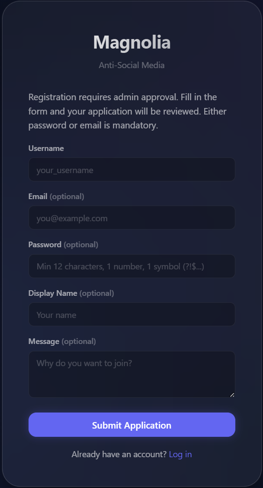
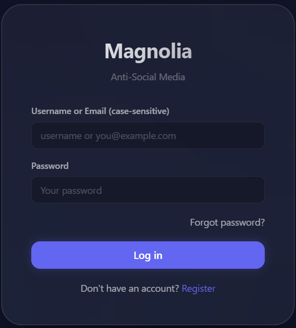
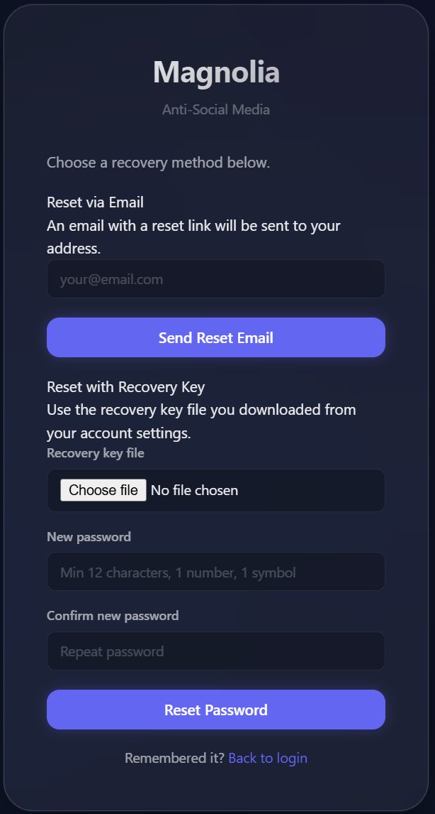
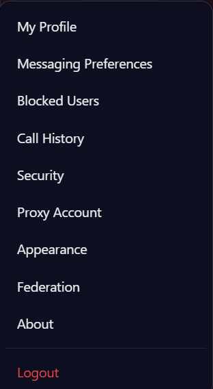
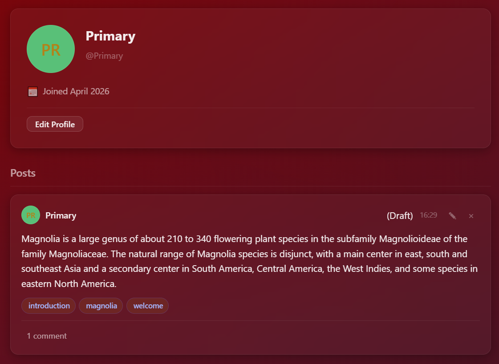
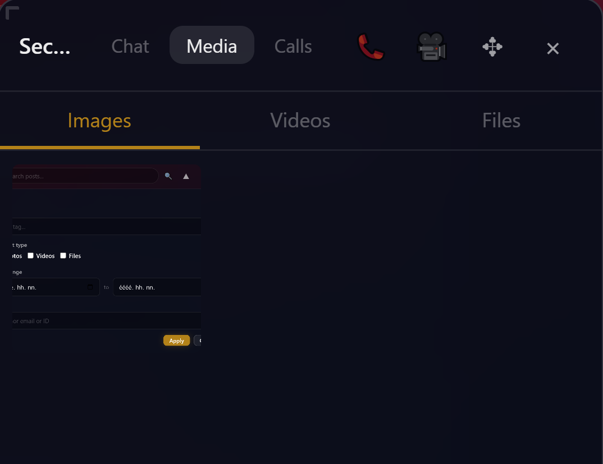
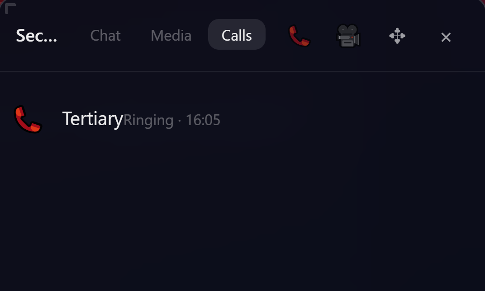
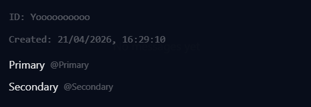

# User guide to browser interface

## Free registration

By "free" we mean that the server owner set registration flow as such that anyone may register to become a user. Generally not suggested for privacy and safety reasons, but it is an option.

Admins may set application type registration, in which case anyone can "apply" to become a user. In this case registration is finalized when an admin appvored it. Until then logins are not allowed. Providing either password or email is mandatory. If email is provided and password is not, an email will be sent with a reset link; while if password is given without email, that password will work.

## Login

User can use both registered e-mail address, or their username. In the system username is the primary key, meaning e-mail is optional. Login details are case-sensitive.

## Password reset

## Main screen

Mostly self-evident.
The V shaped button (triangle pointing down) next to the magnifying glass opens a panel for more refined post searches.

1. Global Voice chat, the gear on the right end displays settings.
2. User list.
3. Events.
4. [User Menu](#user-menu)

After typing a tag, press `enter` to add the tag to the list of tags that must be fulfilled during the search. 

## User menu

## Profile page

## Proxy page

There are two types of authentication options available for proxies.
This is an advanced feature, that most users who are not developers will never touch.
The feature itself is for creating automatization/external data source features (bots),
and a separate documentation is available with the client side codebases.

## Security page

User account security page, with two separate features.
End-to-end encryption, for setting up, removing, changing encryption keys for messaging.
**Please be aware that changing or removing the key will make earlier unreadable.**

Password recovery key is for a feature that needs to be turned on by the server admin.
Users may create and download keys (a file you need to keep secure) that can be used on the .
If you don't have an email server setup (look up SMTP, configurable on the admin panel) you are **Strongly advised** to enable the password recovery key feature, which you can use without emails to change your password, as long as you have the key file.

At the session block the existing sessions of the user are visible, that can be evicted by the user if they feel that they are not familiar with that device. On new sessions events are delivered to the user, so they can be aware of changes.

## User Federation page

Post and messaging whitelist/blacklist system for federated servers.

## Chat Messenger

Regular features that one would expect.

A tab dedicated for displaying media in the chat.

Clicking on the name on the chat pannel opens a details panel with participants.